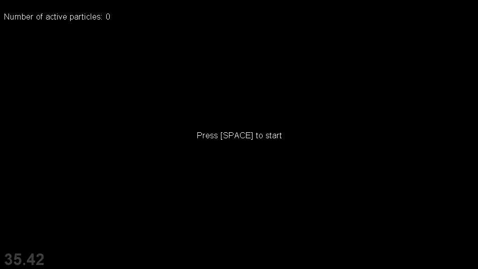

# pyglet-particle-system

Particle Effects for Python with Pyglet using a 2D sprites and system with physical simulation

||
|---|
| An example using the particles |

## Dependencies

To use it you need:

- Python v3.7 or above
- pyglet
- numpy

You can install them by running:

`$ python -m pip install -r requirements.txt`

## Usage

You can see an example in the file **main.py**, and you can run it like this:

`$ python main.py`

